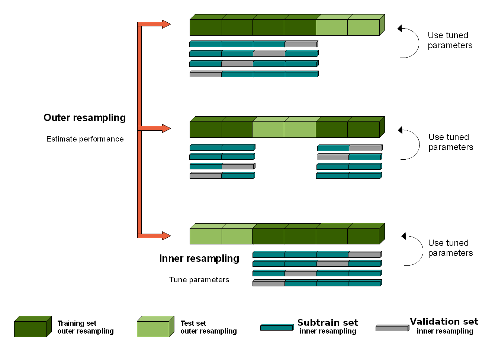

```{r opts, echo=FALSE}
knitr::opts_chunk$set(
  echo=FALSE, results=FALSE,
  dpi=200,
  fig.width=10,
  fig.height=6)
Sys.setlocale("LC_NUMERIC","C")
conda.env <- "2023-08-artificial-intelligence"
conda.dir.vec <- c(
  "~/miniconda3",
  "~/.local/share/r-miniconda")
python <- if(.Platform$OS.type=="unix")"bin/python" else "python.exe"
(conda.dir <- conda.dir.vec[which(dir.exists(conda.dir.vec))[1]])
Sys.setenv(RETICULATE_PYTHON=file.path(conda.dir, "envs", conda.env, python))
reticulate::use_condaenv(conda.env, required=TRUE)
in_render <- !is.null(knitr::opts_knit$get('rmarkdown.pandoc.to'))
if(FALSE){
  ## Take pandoc from bin directory, which has a symlink to
  ## /usr/bin/pandoc 1.19.2.4, which is older/more compatible than
  ## ~/bin/pandoc 2.14.2, does not seem to work with rmarkdown 0.9.5.1
  ## -- error 6 --latex-engine has been removed.  Use --pdf-engine
  ## instead. Actually pandoc >= 2 is required for {=latex} blocks so
  ## better to use version under home.

  ## Sys.setenv(PATH=paste0("bin:",Sys.getenv("PATH")))
  setwd("slides")
  rmarkdown::render("13_kfold.Rmd")
}
```

# Supervised machine learning

- Goal is to learn a function $f(\mathbf x)=y$ where $\mathbf
  x$ is an
  input/feature vector and $y$ is an output/label.
- $x=$image of digit/clothing, $y\in\{0,\dots,9\}$ (ten classes).
- $x=$vector of word counts in email, $y\in\{1,0\}$ (spam or not).
- $x=$image of retina, $y=$risk score for heart disease.
- This week we will focus on a specific kind of supervised learning
  problem called binary classification, which means $y\in\{1,0\}$.
  
---

# Learning algorithm

- We want a learning algorithm \textsc{Learn} which inputs a training
  data set and outputs a prediction function $f$.
- In math a training data set with $n$ observations and $p$ features
  is a matrix $\mathbf X\in\mathbb R^{n\times p}$ with a 
  label vector $\mathbf y\in\{0,1\}^n$.
- On computers it is a CSV file with $n$ rows and $p+1$ columns.
- Want: $\textsc{Learn}(\mathbf X, \mathbf y)\rightarrow f$.
- We will discuss three such data sets from Elements of Statistical
  Learning book by Hastie et al. (mixture slightly modified)
  
```{=latex}
%>>> {k:X.shape for k, (X,y) in data_dict.items()}
%{'spam': (4601, 57), 'zip': (623, 256), 'mixture': (200, 2)}
\small
\begin{tabular}{crrc}
name &observations, $n$ & inputs/features, $p$ & outputs/labels \\
\hline
zip.test & images, 623 & pixel intensities, 256 & 0/1 digits \\
spam & emails, 4601 & word counts, 57 & spam=1/not=0 \\
mixture & people, 200 & height/weight, 2  & democratic/republican \\
\end{tabular}
```

\url{https://github.com/tdhock/cs499-599-fall-2022/tree/master/data}

\url{https://hastie.su.domains/ElemStatLearn/data.html}

---

# Mixture data table

```{python results=TRUE}
from sklearn.neighbors import KNeighborsClassifier
from sklearn.model_selection import GridSearchCV
from sklearn.model_selection import KFold
import plotnine as p9
p9.options.figure_size=(4.5,2.5)
import numpy as np
import pandas as pd
from skimage import measure
import os
# grid/contouring functions
def make_grid(mat, n_grid = 80):
    nrow, ncol = mat.shape
    assert ncol == 2
    mesh_args = mat.apply(
        lambda x: np.linspace(min(x),max(x), n_grid), axis=0)
    mesh_tup = np.meshgrid(*[mesh_args[x] for x in mesh_args])
    mesh_vectors = [v.flatten() for v in mesh_tup]
    return pd.DataFrame(dict(zip(mesh_args,mesh_vectors)))
# https://scikit-image.org/docs/dev/api/skimage.measure.html#skimage.measure.find_contours
# https://scikit-image.org/docs/dev/auto_examples/edges/plot_contours.html#sphx-glr-auto-examples-edges-plot-contours-py
def contour_paths(three_cols, level):
    uniq_df = three_cols.iloc[:,:2].apply(pd.unique)
    n_grid = uniq_df.shape[0]
    fun_mat = three_cols.iloc[:,2].to_numpy().reshape(
        [n_grid,n_grid]).transpose()
    contours = measure.find_contours(fun_mat, level)
    contour_df_list = []
    half_df = (uniq_df-uniq_df.diff()/2)[1:]
    half_df.index = [x-0.5 for x in half_df.index]
    lookup_df = pd.concat([uniq_df, half_df])
    for contour_i, contour_mat in enumerate(contours):
        one_contour_df = pd.DataFrame(contour_mat)
        one_contour_df.columns = [c+"_i" for c in uniq_df]
        one_contour_df["contour_i"] = contour_i
        for cname in lookup_df:
            iname = cname+"_i"
            contour_col = one_contour_df[iname]
            lookup_col = lookup_df[cname]
            index_df = lookup_col[contour_col].reset_index()
            one_contour_df[cname] = index_df[cname]
        contour_df_list.append(one_contour_df)
    return pd.concat(contour_df_list)

# work-around for rendering plots under windows, which hangs within
# emacs python shell: instead write a PNG file and view in browser.
import webbrowser
on_windows = os.name == "nt"
in_render = r.in_render if 'r' in dir() else False
using_agg = on_windows and not in_render
if using_agg:
    import matplotlib
    matplotlib.use("agg")
def show(g):
    if not using_agg:
        return g
    g.save("tmp.png")
    webbrowser.open('tmp.png')

data_dict = {}

spam_df = pd.read_csv(
    "../data/spam.data",
    header=None, sep=" ")
nrow, ncol = spam_df.shape
label_col_num = ncol-1
col_num_vec = spam_df.columns.to_numpy()
label_vec = spam_df[label_col_num]
feature_mat = spam_df.iloc[:,col_num_vec != label_col_num]
data_dict["spam"] = (feature_mat, label_vec)

zip_df = pd.read_csv(
    "../data/zip.test.gz",
    sep=" ", header=None)
label_col_num = 0
col_num_vec = zip_df.columns.to_numpy()
all_label_vec = zip_df[label_col_num]
is01 = all_label_vec.isin([0,1])
label_vec = all_label_vec[is01]
feature_mat = zip_df.loc[is01,col_num_vec != label_col_num]
data_dict["zip"] = (feature_mat, label_vec)

mixture_df = pd.read_csv(
    "../data/ESL.mixture.csv")
#mixture_df.query('party == "democratic" & height_in > 70')
label_col_name = "party"
col_name_vec = mixture_df.columns.to_numpy()
party_vec = mixture_df[label_col_name]
party_tuples = [
    ("democratic","blue",0),
    ("republican","red",1)
]
party_colors = {party:color for party,color,number in party_tuples}
party_number_dict = {party:number for party,color,number in party_tuples}
number_party_dict = {number:party for party,color,number in party_tuples}
def number_to_party_vec(v):
    return np.where(v==0, number_party_dict[0], number_party_dict[1])
label_vec = np.where(
    party_vec == "democratic",
    party_number_dict["democratic"],
    party_number_dict["republican"])
feature_mat = mixture_df.loc[:,col_name_vec != label_col_name]
data_dict["mixture"] = (feature_mat, label_vec)
pd.set_option("display.max_columns", 0)
mixture_df
```

---

# Spam data table

```{python results=TRUE}
pd.set_option("display.max_columns", 6)
spam_df
```

---

# Zip.test data table

```{python results=TRUE}
pd.set_option("display.max_columns", 6)
zip_df
```

---

# Visualize mixture data set

- Each axis represents one column of the $\mathbf X$ matrix.
- Each point represents one row of the $\mathbf X$ matrix.
- Color represents class label $\mathbf y$.

```{python out.height='75%'}
gg = p9.ggplot()+\
    p9.theme(subplots_adjust={'right': 0.7, 'bottom':0.2})+\
    p9.geom_point(
        p9.aes(
            x="height_in",
            y="weight_lb",
            color="party"
        ),
        data=mixture_df)+\
    p9.scale_color_manual(
        values=party_colors)
show(gg)
```

---

# A basic machine learning algorithm

- Goal of supervised learning is to learn a function which predicts the label for new inputs  $x\in\mathbb R^2$.
- K-Nearest neighbors: a simple non-linear algorithm.
- For any new data point, predict the average label of the K nearest neighbors.

---

# Visualize predictions of 1-nearest neighbor algorithm

```{python}
grid_df = make_grid(feature_mat)
#https://stackoverflow.com/questions/55496700/starred-expression-inside-square-brackets does not work?
#np.ogrid[-1:1:5j, -2:3:0.5]
#slice_vec = feature_mat.apply(lambda x: slice(min(x),max(x), complex(imag=n_grid)), axis=0)
grid_mat = grid_df.to_numpy()

neigh = KNeighborsClassifier(n_neighbors=1)
neigh.fit(feature_mat, label_vec)
grid_df["prediction"] = neigh.predict(grid_mat)
prob_mat = neigh.predict_proba(grid_mat)
grid_df["prob1"] = prob_mat[:,1]
grid_df["party"] = number_to_party_vec(grid_df.prediction)
acc = neigh.score(feature_mat, label_vec)*100
acc_df = pd.DataFrame({
    "accuracy_percent":acc,
    "label":f"train set accuracy = {acc}%",
    "height_in":70,
    "weight_lb":147
}, index=[0])
gg = p9.ggplot()+\
    p9.theme_bw()+\
    p9.theme(subplots_adjust={'right': 0.7, "bottom":0.2})+\
    p9.geom_point(
        p9.aes(
            x="height_in",
            y="weight_lb",
            color="party"
        ),
        size=0.1,
        data=grid_df)+\
    p9.geom_point(
        p9.aes(
            x="height_in",
            y="weight_lb",
            fill="party"
        ),
        color="black",
        size=2,
        data=mixture_df)+\
    p9.scale_color_manual(
        values=party_colors)+\
    p9.scale_fill_manual(
        values=party_colors)+\
    p9.geom_label(
        p9.aes(
            x="height_in",
            y="weight_lb",
            label="label"
        ),
        data=acc_df)
show(gg)

```

---

# Also plot decision boundary in grey

```{python}
contour_df = contour_paths(
    grid_df.loc[:,["height_in","weight_lb","prob1"]],
    0.5)
gg_contour = gg+\
    p9.geom_path(
        p9.aes(
            x="height_in",
            y="weight_lb",
            group="contour_i",
        ),
        color="grey",
        data=contour_df)
show(gg_contour)
```

---

# Using learners in python

- python module scikit-learn provides several learner classes such as
  `sklearn.neighbors.KNeighborsClassifier` and
  `sklearn.linear_model.LogisticRegressionCV`, which all use the same
  interface.
- Instantiation: `learner = LogisticRegressionCV()` 
- Training: `learner.fit(train_X, train_y)` where `X` is a matrix of
  `nrow` observations by `ncol` features, and `y` is a vector of
  labels (one for each row of `X`).
- Prediction: `learner.predict(test_X)` returns vector of predictions (one
  for each row/observation in `test_X`).

---

# Is it good to have 100% accuracy on train data?

- Remember: goal is function $f$ with accurate predictions on new inputs.
- What is a new input?
- We must assume that new/test inputs are similar to old/train inputs.
- In the statistical literature this is the iid (independent and identically distributed) assumption.
- We can therefore split the full data set into train/test sets.
- Train set is used to learn the prediction function $f$.
- Test set (simulated new inputs) is used to evaluate the accuracy of the function $f$ (but can not be used to learn function $f$).

---

# K-fold cross-validation for splitting data

- One way to split is via K-fold cross-validation. 
- Each row is assigned a fold ID number from 1 to K.
- For each for ID, those data are held out, and other data are kept.
- Popular relative to other splitting methods because of simplicity and fairness (each row is held out one time).

{width=100%}

---

# Visualization of fold IDs in input/feature space

```{python}
fold_df_list = []
set_df_list = []
shuffle_ggplots = {}
for shuffle, random_state in (True,1), (False,None):
    n_splits = 5
    kf = KFold(
        n_splits=n_splits,
        random_state=random_state,
        shuffle=shuffle)
    mixture_copy = mixture_df.copy()
    mixture_copy['fold'] = pd.NA
    mixture_copy['shuffle'] = shuffle
    shuffle_df_list = []
    for fold, (train_index, test_index) in enumerate(kf.split(label_vec)):
        mixture_copy.loc[test_index,"fold"] = fold
        shuffle_one_fold = mixture_copy.copy()
        shuffle_one_fold["fold"] = fold
        shuffle_one_fold.loc[test_index,"set"] = "test"
        shuffle_one_fold.loc[train_index,"set"] = "train"
        shuffle_df_list.append(shuffle_one_fold)
    shuffle_df = pd.concat(shuffle_df_list)
    set_df_list.append(shuffle_df)
    gg = p9.ggplot()+\
        p9.ggtitle(f"KFold(n_splits={n_splits}, shuffle={shuffle})")+\
        p9.geom_point(
            p9.aes(
                x="height_in",
                y="weight_lb",
                color="party"
            ),
            data=shuffle_df)+\
        p9.scale_x_continuous(breaks=[68,72])+\
        p9.scale_color_manual(
            values=party_colors)+\
        p9.theme(subplots_adjust={'right': 0.65, "bottom":0.2, "top":0.9})+\
        p9.facet_grid("set ~ fold", labeller="label_both")
    shuffle_ggplots[shuffle] = gg
    fold_df_list.append(mixture_copy)
set_df = pd.concat(set_df_list)
fold_df = pd.concat(fold_df_list)

gg = p9.ggplot()+\
    p9.theme(subplots_adjust={'right': 0.7, 'bottom':0.2})+\
    p9.geom_point(
        p9.aes(
            x="height_in",
            y="weight_lb",
            color="party"
        ),
        data=fold_df.query("shuffle==True"))+\
    p9.scale_color_manual(
        values=party_colors)+\
    p9.scale_x_continuous(breaks=[68,72])+\
    p9.facet_grid(". ~ fold", labeller="label_both")
show(gg)
```

---

# Visualization of splits/sets in input/feature space

```{python}
show(shuffle_ggplots[True])
```

---

# One split

```{python}
one_split = set_df.query("fold==0 & shuffle==True")
gg = p9.ggplot()+\
    p9.geom_point(
        p9.aes(
            x="height_in",
            y="weight_lb",
            color="party"
        ),
        data=one_split)+\
    p9.scale_color_manual(
        values=party_colors)+\
    p9.theme(subplots_adjust={'right': 0.7, 'bottom':0.2})+\
    p9.facet_grid(". ~ set", labeller="label_both")
show(gg)
```

---

# Nearest neighbor predictions

```{python}
train_df = one_split.query("set=='train'")
train_feature_mat = train_df[feature_mat.columns]
train_label_vec = train_df.party
all_acc_df_list = []
def plot_neighbors(n_neighbors):
    neigh = KNeighborsClassifier(n_neighbors=n_neighbors)
    neigh.fit(train_feature_mat, train_label_vec)
    grid_df["prediction"] = neigh.predict(grid_mat)
    prob_mat = neigh.predict_proba(grid_mat)
    grid_df["prob1"] = prob_mat[:,1]
    grid_df["party"] = grid_df.prediction
    one_split["pred"] = neigh.predict(one_split[feature_mat.columns])
    one_split["correct"] = one_split.party == one_split.pred
    acc_percent = one_split.groupby("set")["correct"].mean()*100
    acc_df = acc_percent.reset_index()
    acc_df["height_in"] = 70
    acc_df["weight_lb"] = 147
    acc_df["label"] = "accuracy = " + acc_df.correct.astype(str) + "%"
    acc_df["n_neighbors"] = n_neighbors
    all_acc_df_list.append(acc_df)
    return p9.ggplot()+\
        p9.ggtitle(f"{n_neighbors} nearest neighbors")+\
        p9.theme_bw()+\
        p9.theme(subplots_adjust={'right': 0.7, "top":0.8, "bottom":0.2})+\
        p9.facet_grid(". ~ set", labeller="label_both")+\
        p9.geom_point(
            p9.aes(
                x="height_in",
                y="weight_lb",
                color="party"
            ),
            size=0.1,
            data=grid_df)+\
        p9.geom_point(
            p9.aes(
                x="height_in",
                y="weight_lb",
                fill="party"
            ),
            color="black",
            size=2,
            data=one_split)+\
        p9.scale_color_manual(
            values=party_colors)+\
        p9.scale_fill_manual(
            values=party_colors)+\
        p9.geom_label(
            p9.aes(
                x="height_in",
                y="weight_lb",
                label="label"
            ),
            size=6,
            data=acc_df)
show(plot_neighbors(1))

```

---

# Nearest neighbor predictions

```{python}
show(plot_neighbors(2))
```

---

# Nearest neighbor predictions

```{python}
show(plot_neighbors(3))
```

---

# Nearest neighbor predictions

```{python}
show(plot_neighbors(4))
```

---

# Nearest neighbor predictions

```{python}
show(plot_neighbors(5))
```

---

# Nearest neighbor predictions

```{python}
show(plot_neighbors(10))
```

---

# Nearest neighbor predictions

```{python}
show(plot_neighbors(50))
```

---

# Nearest neighbor predictions

```{python}
show(plot_neighbors(100))
```

---

# Accuracy for each number of neighbors

```{python}
all_acc_df = pd.concat(all_acc_df_list)
gg = p9.ggplot()+\
    p9.theme(subplots_adjust={'right': 0.8, 'bottom':0.2})+\
    p9.scale_y_continuous(
        name="Percent accuracy")+\
    p9.geom_line(
        p9.aes(
            x="n_neighbors",
            y="correct",
            color="set",
            group="set"
        ),
        data=all_acc_df)
show(gg)
```

---

# Two kinds of splits

{width=100%}

https://mlr.mlr-org.com/articles/tutorial/nested_resampling.html

---

# Implementing splits in python

- Full data into train/test -> `sklearn.model_selection.KFold`. For evaluating prediction accuracy and comparing different algorithms.
- Train into subtrain/validation -> `sklearn.model_selection.GridSearchCV`. For learning hyper-parameters such as `n_neighbors` which must be fixed before running the learning algorithm / computing predictions.

---

# Basic idea of linear model

- Learn a function $f(\mathbf x)=\hat y=\mathbf w^T \mathbf x+\beta\in\mathbb
  R$, larger values for more likely to be positive class.
- Predict positive class when $f(\mathbf x)>0$.
- Optimize weights $\mathbf w$ and intercept $\beta$ to minimize
  logistic loss.
- If labels are recoded as $y\in\{-1,1\}$ then logistic loss is
  $\ell(\hat y, y)=\log[1+\exp(-\hat y y)]$.

```{python}
from sklearn.linear_model import LogisticRegression
lr = LogisticRegression().fit(feature_mat, label_vec)
grid_df["prediction"] = lr.predict(grid_mat)
grid_df["party"] = number_to_party_vec(grid_df.prediction)
p9.options.figure_size=(4.5,2)
gg = p9.ggplot()+\
    p9.theme_bw()+\
    p9.theme(subplots_adjust={'right': 0.7, 'bottom':0.2})+\
    p9.geom_point(
        p9.aes(
            x="height_in",
            y="weight_lb",
            color="party"
        ),
        size=0.1,
        data=grid_df)+\
    p9.geom_point(
        p9.aes(
            x="height_in",
            y="weight_lb",
            fill="party"
        ),
        color="black",
        size=2,
        data=mixture_df)+\
    p9.scale_color_manual(
        values=party_colors)+\
    p9.scale_fill_manual(
        values=party_colors)
show(gg)

```

---

# How to fairly compare linear model with nearest neighbors?

- Use cross validation!
- For each train/test split, use the train set as input to each
  learning algorithm.
- Train set may be further split into subtrain/validation sets for
  learning hyper-parameters.
  - Nearests neighbors: number of neighbors, done automatically if you
    use `KNeighborsClassifier` with `GridSearchCV`.
  - Linear model: amount of L2 or early stopping regularization, done
    automatically by `sklearn.linear_model.LogisticRegressionCV`.
- Compute predictions of learned models on test set.
- Also compute a featureless baseline: predict, for every item in test
  set, the most frequent class in train labels.
  - if there is any learnable relationship at all between
    inputs/features and outputs/labels, then algorithm should be more
    accurate than featureless baseline.
- Average over several train/test splits (K folds of CV).
